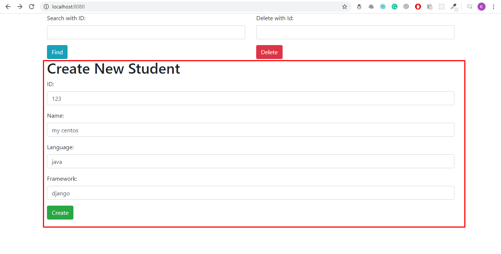
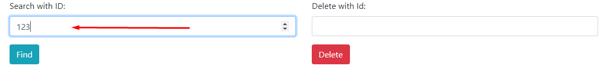
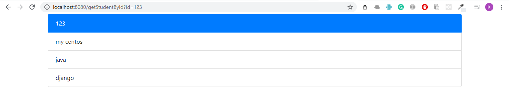
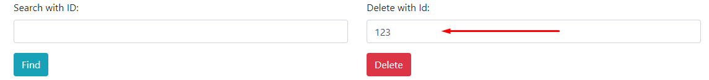

# Rest-with-Ui

This repository contains project that is used to allow CRUD operations based on Representational state transfer, built using 

BACKEND :
Java, Spring Boot.

Frontend:
Bootstrap

This allows you to add, view and delete a student from the database.

# USAGE

# Create a student profile
The end-user can create a student by entering his details, this enables a POST request to the API and thus adds the user to the database.

# Get a student profile

Enter the ID and click find to get the student matching the ID. This is basically a GET request to the database.

This displays the details of the Student with that ID.

# Delete a student profile

Enter the ID of the student, that you want to remove from the database. This performs a DELETE request to the databse and removes the student.

